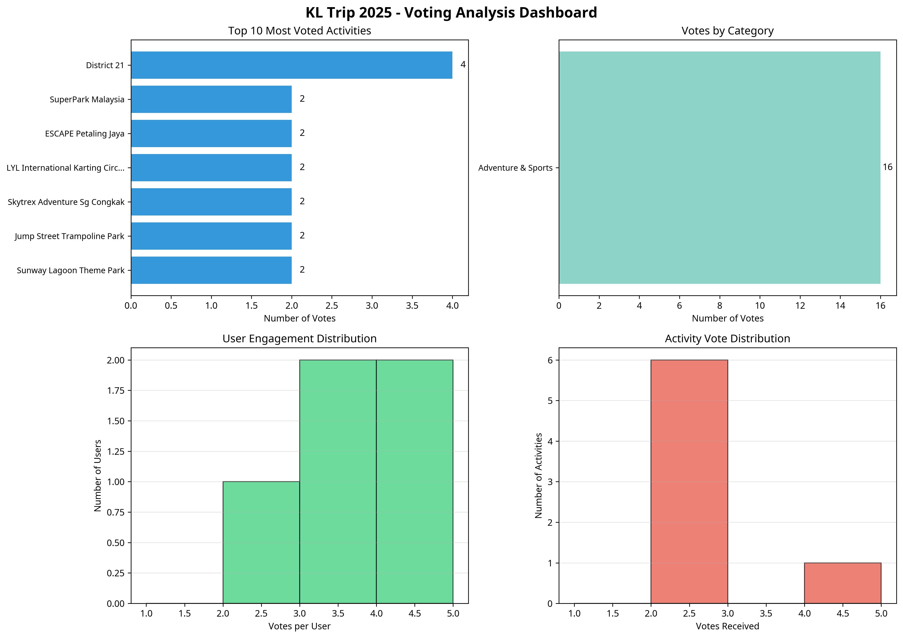

# Daily Report: KL Trip 2025 - October 16, 2025

**Author:** Manus AI
**Date:** October 16, 2025

## 1. Introduction

This report details the daily review for the KL Trip 2025 website, executed on October 16, 2025. Today is Day 10 of the content rotation, focusing on the **Adventure & Sports** category. This report outlines the seven new activities that have been researched and added to the database, along with an analysis of the current user voting data to identify popular activities and engagement trends.

## 2. New Adventure & Sports Activities

Seven new activities were researched and selected for the Adventure & Sports category. These activities offer a diverse range of experiences suitable for a group of 8 people and are located within or near Kuala Lumpur. The following table provides a summary of these new additions:

| Activity Name                  | Location            | Description                                                                                                                                                             | Price (per person) | Duration      |
| ------------------------------ | ------------------- | ----------------------------------------------------------------------------------------------------------------------------------------------------------------------- | ------------------ | ------------- |
| Camp5 Jumpa Climbing Gym       | Bukit Bintang       | Indoor climbing and active park with lead walls, bouldering, and ninja courses.                                                                                         | RM 30 - 90         | 2-3 hours     |
| WINDLAB Indoor Skydiving       | Petaling Jaya       | Malaysia's only indoor skydiving facility simulating free-fall in a safe environment.                                                                                   | RM 108 - 198       | 1-1.5 hours   |
| Jump Street Trampoline Park    | Petaling Jaya       | Large indoor trampoline park with various attractions like dodgeball, foam pits, and ziplines.                                                                        | RM 29 - 70         | 3+ hours      |
| Arena 51 Archery Tag           | Mobile (KL)         | Combat sport combining archery, paintball, and dodgeball with foam-tipped arrows.                                                                                       | RM 31 - 42         | 45-120 mins   |
| Sunway Lagoon Theme Park       | Petaling Jaya       | A massive multi-park destination with water slides, amusement rides, and a wildlife park.                                                                               | RM 145 - 245       | Full Day      |
| Skytrex Adventure Shah Alam    | Shah Alam           | High-rope obstacle courses and ziplines set in a natural forest environment.                                                                                            | RM 45 - 70         | 2-3 hours     |
| VAR LIVE VR Theme Park         | Kuala Lumpur        | Malaysia's largest virtual reality theme park with 13 different immersive experiences.                                                                                  | RM 46+             | 1-3 hours     |

## 3. Voting Data Analysis

An analysis of the user voting data was conducted to understand user preferences and engagement. The analysis provides insights into the most popular activities and categories, as well as user participation levels.

### Key Statistics

- **Total Votes:** 16
- **Unique Users:** 5
- **Activities with Votes:** 7 out of 28
- **Average Votes per User:** 3.2
- **Average Votes per Voted Activity:** 2.29

### Voting Analysis Dashboard

The following dashboard visualizes the voting data, highlighting the top-voted activities, vote distribution by category, user engagement, and overall activity popularity.

### Analysis Summary

The voting data indicates a strong preference for the **Adventure & Sports** category, which has received all 16 votes so far. **District 21** is the most popular activity with 4 votes, while six other activities have received 2 votes each. User engagement is high, with an average of 3.2 votes per user. This data suggests a clear interest in active and thrilling experiences among the user base.

## 4. Conclusion

Today's review successfully added seven new Adventure & Sports activities to the KL Trip 2025 website and provided a detailed analysis of user voting patterns. The insights gained from the voting data will be valuable for future content planning and itinerary suggestions. The next step is to update the website with the new activities and ensure all changes are deployed correctly.

---

**End of Report**
